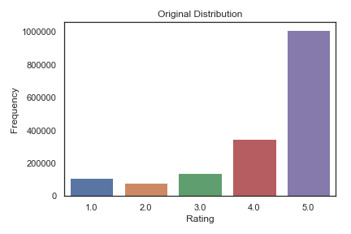
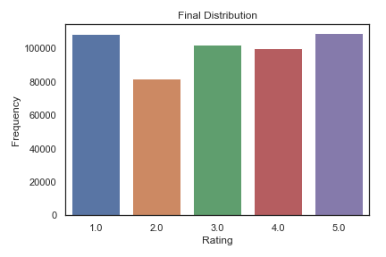
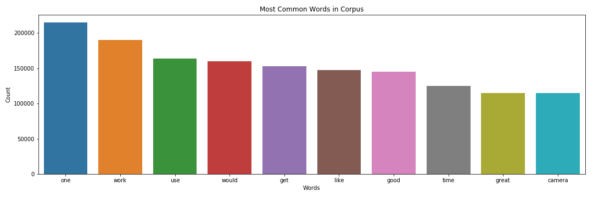
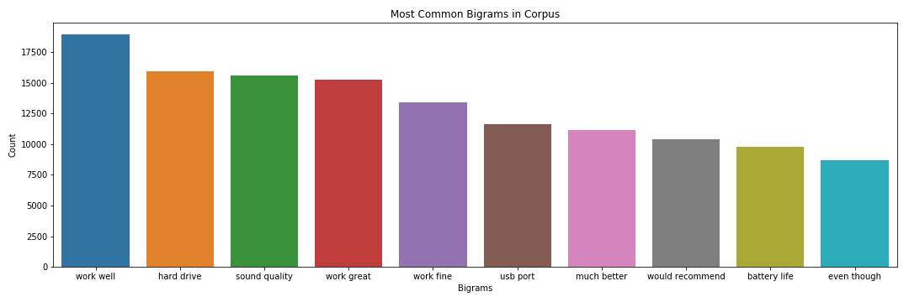
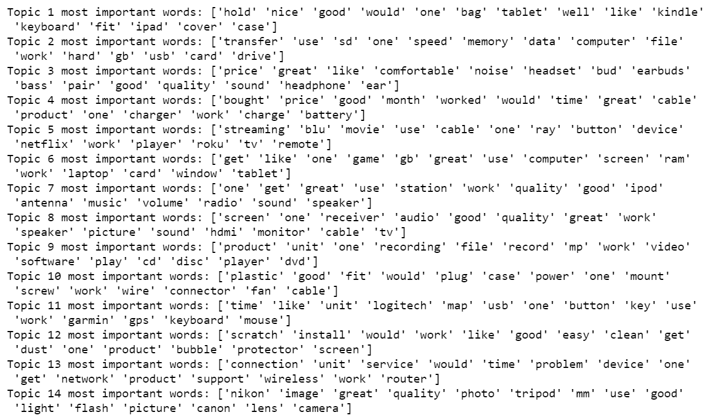
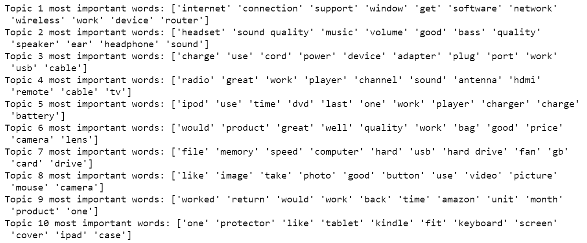

# Amazon_Reviews_NLP_Project

Contributors: Kristina Barounis & Gal Gilor

_For those interested in a shorter recap:_ [_Presentation Slides_](https://docs.google.com/presentation/d/1dF3VB5U5Fo8iZQH7u2HldzgVSD0MbeFAMT4BajeQ-b8/edit?usp=sharing "Presentation")

## Introduction

This project utilizes natural language processing techniques and algorithms and a dataset of customer reviews from Amazon's electronic products department to answer the following two questions:

1. Do written reviews of Amazon Products align with their associated ratings?

2. What are the most discussed topics in these reviews?

### Table of Contents

   - [Tech Stack](#tech-stack)

   - [Process](#process)

   - [Data and EDA](#data-and-eda)
       
   - [Part 1: Supervised](#part-1-supervised-models)

   - [Part 2: Unsupervised](#part-2-unsupervised-models)

   - [Future Improvements](#future-improvements)

## Tech Stack

- Python libraries
    - Pandas
    - NLTK
    - Gensim
    - Scikit-learn
    - Matplotlib
    - Seaborn

## Process

For this project, we used a Stanford dataset of Amazon product reviews spanning 18 years. We cleaned the data using standard NLP techniques (i.e. removing stop words, lemmatizing, and tokenizing). We then used supervised classification algorithms to classify reviews into rating buckets (1-5). Additionally, we used an unsupervised topic modeling algorithm (LDA) to cluster reviews into topics.
  
## Data and EDA

The original dataset contained 1.7 million reviews on electronic products sold on Amazon. We dropped 1.2 million to reduce class imbalance across rating buckets, ultimately resulting in ~502,000 observations.

 

We completed a number of pre-processing and data cleaning steps including removing punctuation and stop words, making all letters lowercase, and lemmatizing words. Each of these steps was performed so that words could be grouped together based on their lemma and weren't instead treated as individual words.

As part of our exploration, we looked at the most common words and bigrams in our corpus. Many of the most common words ultimately get removed as stop words or through our vectorization strategy in which we require words to appear in less than 50% of the documents. Interestingly, many of the most common bigrams become key components in the topics produced by the unsupervised LDA model.

 

We also engineered a number of features. However, these were ultimately excluded from the models as it became evident that these features had little impact on leading to accurate predictions of ratings.

- number of words in a review
- number of exclamation points used in a review
- number of question markers used in a review

## Part 1: Supervised models

Here we only discuss our initial and final models. For a look at the additional models we tested, please see the python notebook titled Supervised_Models.

1. Dummy Classifier:
   - The Dummy Classifier acheieved an accuracy score of 20%, given our data is distributed across 5 rating categories.

2. Multinomial Naive Bayes
   - The Multinomial Naive Bayes model was able to achieve the highest accuracy score of 46.5%
   - We used NLTK's TF-IDF vectorizer with the following parameters:
      - A maximum of 2500 features
      - Each word was required to appear in a minimum of 15 reviews
      - Each word was required to appear in no more than 50% of the reviews
 

The confusion matrix shows the accuracy of the model across rating buckets. The model performed best when predicting ratings of 1 and 5, with 73% and 66% of the observations correctly classified, respectively. This is in line with our expectations, given these are likely to be the reviews with the most polarizing language. Additionally, the model performed worst on reviews with ratings of 2 given we had the fewest observations in this rating bucket.

## Part 2: Unsupervised models

### Topic Modeling with LDA

Before running the model we noticed additional processing is needed. We began by removing single character words and all the stand-alone digits. Unsure about the pros and cons of the different libraries for NLP, we utilized both Gensim and scikit-learn to run LDA models for topic modeling.

- scikit-learn
  1) We chose 14 as the number of topics (Amazon electronics department is made out of 14 sections). Additionally, we filtered out words that appeared in more than 50% of the reviews and words that appeared in less than 10 reviews. Looking at topics, we noticed that some words appear on several topics, meaning the topics are not independent of each other.

  2) We lowered the number of topics to 10 filtered words that appeared in more than 50% of reviews, and words that appeared in less than 15 reviews. Lowering the number of topics helped address the dependency problem between topics.

_14 topics LDA model_

_10 topics LDA model_

- Gensim
   1) Lowering the number of topics and filtering words that appeared in over 50% of documents seemed to work well, thus we reused those hyperparameters. Also, we filtered the words that appeared in less than 10 reviews.

Every model returned slightly different results. The gensim LDA model created the most distinguishable topics in our eyes. Unfortunately, due to a lack of computing power and time, we were unable to use topic modeling for classification purposes.

## Future Improvements

1. Optimize text cleaning process
    - Given this was our first time working with NLP techniques, we did not create an optimal pipeline for NLP pre-processing. We tokenized and lemmatized our text before realizing that NLTK's vectorizers take in a corpus of documents, rather than a list of tokens, to create vectors.
    - Due to time constraints, we could not fine tune the model to return only distinct topics

2. Use topics derived from LDA in supervised classification algorithms
    - We would have liked to have used the topics derived from the unsupervised learning algorithm, LDA, as classes in a supervised classification model.
